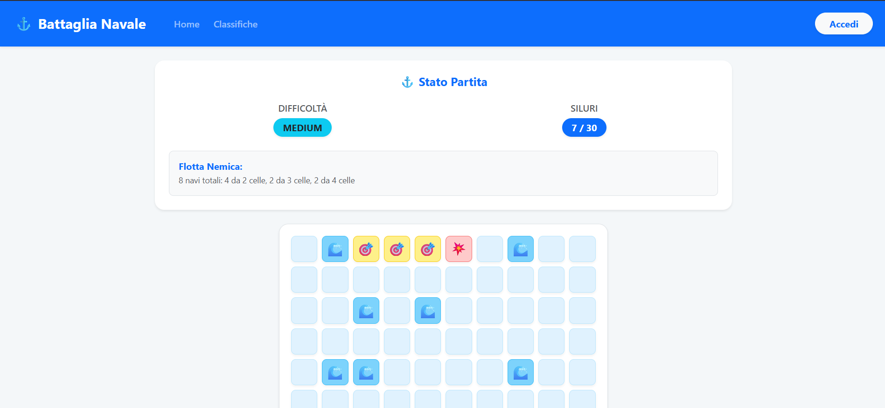

# Battleship Web Game

A full-stack web application implementing the classic Battleship game. This project features casual matches against a server-side engine, competitive tournaments with deterministic boards, and a global leaderboard.

## Features

- **Casual Mode:** Play against the server with varying difficulty levels (Easy, Medium, Hard).
- **Tournaments:** Authenticated users can create or join tournaments using unique 6-character codes. Boards in a tournament are deterministic to ensure fair competition.
- **Global Leaderboard:** Track the best players based on their win rates and total matches played.
- **User Authentication:** Secure login and registration using Passport.js and bcrypt.
- **Responsive UI:** Modern, mobile-friendly interface built with React and Bootstrap.

## Technologies Used

### Frontend
- **React 19** with **Vite**
- **React Router** for navigation
- **React Bootstrap** for styling and UI components

### Backend
- **Node.js** & **Express**
- **SQLite3** for data persistence
- **Passport.js** for session-based authentication

## Screenshots



## Architecture Overview

- **Client-Side:** The React frontend is structured around a central `GameRoute` that acts as the main smart component, handling game state, API interactions, and error handling. The game board is rendered using optimized, stateless components (`Board` and `Cell`) for efficient state derivation.
- **Server-Side:** An Express REST API handles match logic, hit/miss calculations, session management, and database interactions.
- **Database:** An SQLite database stores user credentials, tournament data, and global statistics.

## Getting Started

### Prerequisites
- [Node.js](https://nodejs.org/) installed on your machine.

### Installation

1. **Clone the repository:**
   ```bash
   git clone <repository-url>
   ```

2. **Install Server Dependencies:**
   ```bash
   cd server
   npm install
   ```

3. **Install Client Dependencies:**
   ```bash
   cd ../client
   npm install
   ```

### Running the Application

1. **Start the Backend Server:**
   ```bash
   cd server
   node index.js
   ```
   *The backend server will run on `http://localhost:3001`.*

2. **Start the Frontend Development Server:**
   ```bash
   cd client
   npm run dev
   ```
   *The Vite development server will start on `http://localhost:5173`.*

### Default Test Users
The database is pre-populated with some test accounts if you'd like to test the authenticated features immediately:
- **user1** / password
- **user2** / password
- **user3** / password

## License
This project is open-source and available under the ISC License.
